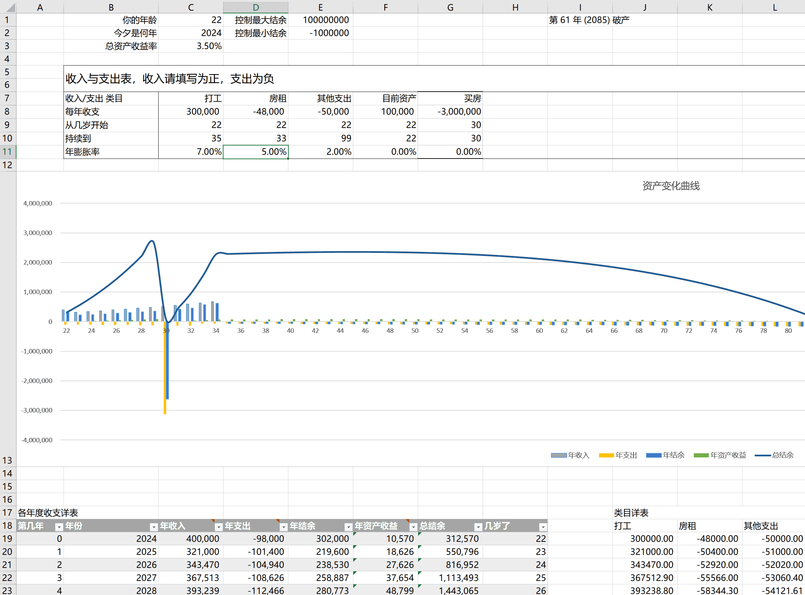

# 躺平计算器 fire-calculate

Financial Independence, Retire Early (FIRE) Calculator

用于计算你的躺平规划是否靠谱，根据收支以及收支膨胀率来看看你的躺平计划可以坚持多久

下面是一个示例：

- 目前资产 10 万，年入 30 万，工作到 35 岁
- 总资产收益率 3.5%
- 房租通胀 5%，其他支出跟随常年通胀率 2%
- 买房一次性付清 300 万

最后得到的计算结果是到第 61 年（2085）破产

---

### 使用方法

#### 下载 excel 自行计算

直接下载本仓库根目录的 [躺平计算器.xlsx](躺平计算器.xlsx) 用 Microsoft Office Excel 打开即可

#### 在线文档

使用下面在线文档，创建副本到你的个人空间进行计算：

- 飞书模板文档：https://eqyrx3fg3l.feishu.cn/sheets/Rofps2lj8hYeGktI0WtcpMugnib
- 腾讯文档：https://docs.qq.com/sheet/DR0hUdHBYQ3VZanhG

### 写在最后

参考了一些项目搭建的这个计算器，但迫于很多项目都使用 web 搭建，甚至很多项目是不开源的，对于代码小白来说如果有自己的诉求，也不方便改造，同时网站也不能完全保护隐私，因此决定搭建这个开源工具

一些参考：

1. 开源的，来自豆瓣小组的，用 html+js 编写：https://firecalculate.github.io/
2. 一个很棒的网页，但可惜是闭源的：https://retire.money/
